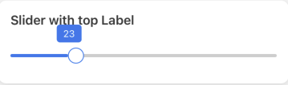
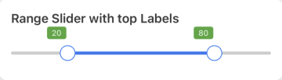
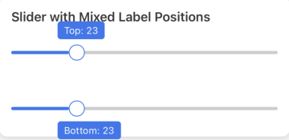
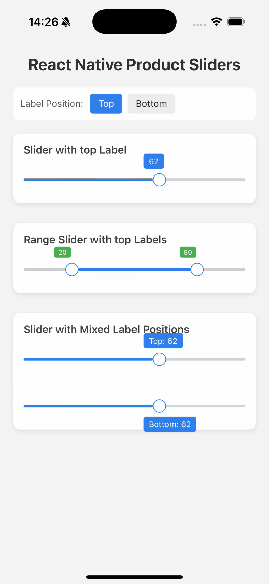

# React Native Product Sliders

[](https://www.npmjs.com/package/react-native-product-sliders)
[](https://www.npmjs.com/package/react-native-product-sliders)
[](https://www.typescriptlang.org/)
[](./LICENSE)

A customizable slider and range slider component for React Native with Material-UI like features.

## Screenshots

<div style="display: flex; flex-wrap: wrap; gap: 16px; margin: 20px 0;">
  
  
  
  
</div>

## Features

- Single slider and range slider variants
- Customizable thumb, track, and marker styles
- Step-based sliding
- RTL support
- Custom labels and markers
- Touch-friendly interaction area
- Callbacks for sliding events
- TypeScript support

## Installation

```bash
npm install react-native-product-sliders
# or
yarn add react-native-product-sliders
```

## Components

### Slider

A single thumb slider component.

#### Props

| Prop                  | Type                                 | Default  | Description                     |
| --------------------- | ------------------------------------ | -------- | ------------------------------- |
| `min`                 | `number`                             | `0`      | Minimum value                   |
| `max`                 | `number`                             | `100`    | Maximum value                   |
| `step`                | `number`                             | `1`      | Step value                      |
| `value`               | `number`                             | `min`    | Current value                   |
| `disabled`            | `boolean`                            | `false`  | Disable interaction             |
| `thumbStyle`          | `object`                             | `{}`     | Style for the thumb             |
| `trackStyle`          | `object`                             | `{}`     | Style for the base track        |
| `selectedTrackStyle`  | `object`                             | `{}`     | Style for the selected track    |
| `markerStyle`         | `object`                             | `{}`     | Style for markers               |
| `showMarkers`         | `boolean`                            | `false`  | Show step markers               |
| `labelPosition`       | `"top" \| "bottom"`                  | `"top"`  | Position of the label           |
| `labelWidth`          | `number \| "auto"`                   | `"auto"` | Width of the label              |
| `labelLeftAdjustment` | `number`                             | `0`      | Left adjustment for the label   |
| `onValueChange`       | `(value: number) => void`            | -        | Callback when value changes     |
| `onSlidingStart`      | `(value: number) => void`            | -        | Callback when sliding starts    |
| `onSlidingComplete`   | `(value: number) => void`            | -        | Callback when sliding completes |
| `renderLabel`         | `(value: number) => React.ReactNode` | -        | Custom label renderer           |
| `renderMarker`        | `(value: number) => React.ReactNode` | -        | Custom marker renderer          |

### RangeSlider

A dual-thumb range slider component.

#### Props

| Prop                 | Type                                  | Default | Description                     |
| -------------------- | ------------------------------------- | ------- | ------------------------------- |
| `min`                | `number`                              | `0`     | Minimum value                   |
| `max`                | `number`                              | `100`   | Maximum value                   |
| `step`               | `number`                              | `1`     | Step value                      |
| `minRange`           | `number`                              | `1`     | Minimum range between thumbs    |
| `lowValue`           | `number`                              | `min`   | Current low value               |
| `highValue`          | `number`                              | `max`   | Current high value              |
| `disabled`           | `boolean`                             | `false` | Disable interaction             |
| `thumbStyle`         | `object`                              | `{}`    | Style for the thumbs            |
| `trackStyle`         | `object`                              | `{}`    | Style for the base track        |
| `selectedTrackStyle` | `object`                              | `{}`    | Style for the selected track    |
| `markerStyle`        | `object`                              | `{}`    | Style for markers               |
| `showMarkers`        | `boolean`                             | `false` | Show step markers               |
| `onRangeChange`      | `(low: number, high: number) => void` | -       | Callback when range changes     |
| `onSlidingStart`     | `(low: number, high: number) => void` | -       | Callback when sliding starts    |
| `onSlidingComplete`  | `(low: number, high: number) => void` | -       | Callback when sliding completes |
| `renderLabel`        | `(value: number) => React.ReactNode`  | -       | Custom label renderer           |
| `renderMarker`       | `(value: number) => React.ReactNode`  | -       | Custom marker renderer          |

## Usage

### Basic Slider

```jsx
import { Slider } from 'react-native-product-sliders';

<Slider min={0} max={100} value={50} onValueChange={value => console.log(value)} />;
```

### Range Slider

```jsx
import { RangeSlider } from 'react-native-product-sliders';

<RangeSlider
  min={0}
  max={100}
  lowValue={20}
  highValue={80}
  onRangeChange={(low, high) => console.log(low, high)}
/>;
```

### Custom Styling

```jsx
<Slider
  min={0}
  max={100}
  value={50}
  thumbStyle={{ backgroundColor: 'red' }}
  trackStyle={{ backgroundColor: 'lightgray' }}
  selectedTrackStyle={{ backgroundColor: 'green' }}
/>
```

### Custom Labels and Markers

```jsx
<Slider
  min={0}
  max={100}
  step={10}
  showMarkers
  renderLabel={value => <Text>{value}</Text>}
  renderMarker={value => <Text style={{ fontSize: 10 }}>{value}</Text>}
/>
```

## Contributing

Contributions are welcome! Please follow these steps:

1. Fork the Project
2. Create your Feature Branch (`git checkout -b feature/amazing-feature`)
3. Commit your Changes (`git commit -m 'Add some amazing feature'`)
4. Push to the Branch (`git push origin feature/amazing-feature`)
5. Open a Pull Request

## License

MIT © [KGG Dev](https://github.com/gitfullstacker)

## Contact

KGG Dev - [@kgg.dev.company](https://www.facebook.com/kgg.dev.company) - fullstackdev2024@gmail.com

Project Link: [https://github.com/gitfullstacker/react-native-product-sliders](https://github.com/gitfullstacker/react-native-product-sliders)
